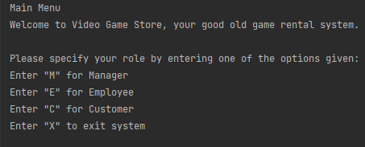
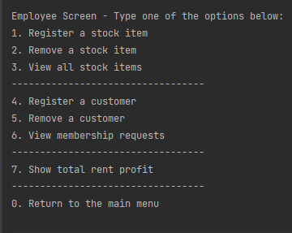
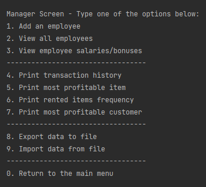
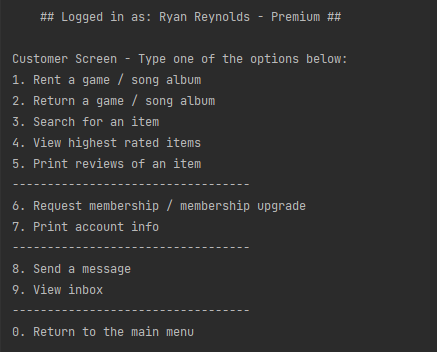
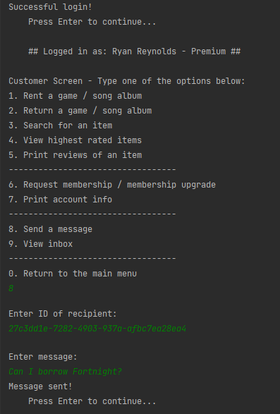
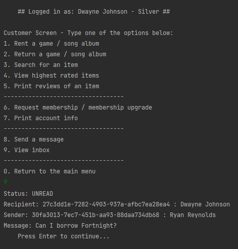

# Video Game Rental System
## Description
A simple console-based application that simulates renting video games from a retail store.
This project is intended to illustrate fundamental OOP concepts as well basic as use of the Java library.

## Application
This menu-run program allows customers, employees and managers to log-in to the system and execute various tasks.

<!--- <kbd>  </kbd> --->

### Main menu

Click to expand

### Employee menu

Click to expand

### Manager menu

Click to expand

### Customer menu

### Feature: Messaging system
 

 
Sending messages

 
Receiving messages

### Feature: Transactions of games and song albums

 
Renting and returning

>Games and songs can be rented and returned by Customers. The dates of the rental and the return are used to calculate the cost.

 
Searching, sorting and storing rent history

> Games and songs can be sorted and searched based on ratings or year.
A manager can view and store a complete rental history (item, cost, renter, profit).

### Feature: Membership system

 
Requests, upgrades and approvals

> Memberships are granted to customers based on their level of spending. Customers can
request an upgrade, and Employees can approve these requests. Responses are sent to the customer's inbox.

### Feature: Import and export data

 
Files

> Files to import can include mixed content, including Employee data, stock items, and Customers.
Transaction history can be exported to file.

### Feature: Finances and stats

 
Profit

> Managers can view the most profitable items, the most profitable customers and the rent-frequency of each stock item.

 
Salaries

> Managers can view the calculated net salary of employees, taxed at 30%. Salary bonuses are rewarded based on the age range of the Employee.

### Feature: Review games and song albums

 
Reviews

> Games and songs can be rated and reviewed by a customer who has rented the item. The average rating of each stock item is also available.

